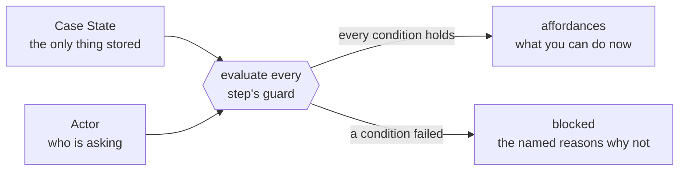

# Affordance

**The engine computes the steps that are available on a case, now, for one
actor. No person declares a flow.**

Affordance is a code-first framework for adaptive case management. A case is a
long-lived business matter: a house purchase, a claim, an onboarding, a
dispute. The framework computes the available next steps from guards over the
case state. It does not read them from a flow that a person drew.

## The problem

Each team that models a real business process writes code such as this:

```ts
if (case.status === 'awaiting_verification' && case.buyer.verificationCleared && !case.agreementSent) {
  // …and forty more branches, in three files, drifting apart
}
```

This code operates until the process changes. A status column is a program
counter. When the process changes, each in-flight row points at a position
that is now wrong. You must then correct the status column of each row by
hand.

A workflow engine with a declared graph is the heavy alternative. It moves the
program counter into the engine. But each deploy asks the same question: where
is this in-flight case in the new structure? A case can stay open for months.
Then only two answers are possible: keep each old version of the process live
until its last case ends, or do manual migration on live cases.

## The idea

**Do not store the position of a case. Compute what the case can do.**



A case type declares two things: a state schema and a set of steps. Each step
has its own guard. There is no flow, no stage, no graph, and no status field.
There is also no completion test, because completion is a fact in the case
state. The only position of a case is its case state. The engine computes the
available steps on demand:

```ts
// Bind the step author to the state schema, one time per case type.
// Every condition, selector, and handler below gets its types from it.
const purchaseStep = stepsOf(PurchaseState, actor<PurchaseActor>())

const escalateVerification = purchaseStep({
  name: 'escalate-verification',
  // one affordance per buyer under review — not one per case
  scope: { select: s => s.buyers.filter(b => b.verification.status === 'review'),
           key: b => b.id },
  permits: { isEscrowOfficer },
  handler: async (s, ctx) => ({ /* …the next state… */ }),
})
```

Ask the engine what a case can do, as one actor:

```ts
const { affordances, blocked } = await engine.affordances(caseId, escrowOfficer)

// affordances → [{ step: 'escalate-verification', scopeKey: 'buyer_007', input: … }]
// blocked     → [{ step: 'close-purchase', possible: false, permitted: true,
//                  unmet: [{ name: 'allSigned', reason: '2 buyers have not signed' }] }]
```

The `blocked` array is as important as the `affordances` array. Each condition
has a name. When a person asks "why can I not close this purchase?", the
engine answers with those names, in the words of the domain. An engineer does
not have to read the code to give the answer.

## What you get

The engine stores no position, and each guard is pure and structured. These
results follow:

- **A process change is a deploy.** Change the step definitions. The new
  definitions immediately govern each in-flight case. No case migrates. When a
  new step or condition ships, the correct affordances become available on
  each case, at each position, at that moment.
- **Every execution has an actor.** A person takes an affordance. An external
  system's event executes a step through ingestion. Time is an external system
  too: a scheduler outside the engine executes a step such as "mark overdue"
  like any other caller. The framework never runs a step of its own accord,
  so the journal always names who acted.
- **The audit is exact.** Each execution journals the guard evaluation and the
  case state that the guard read. The journal answers "why was this step
  available last Tuesday?" from that record. The engine never derives the
  answer again through today's code.
- **A machine can read the HTTP contract.** Each affordance carries its own
  execute link and its own input schema. A client needs no other knowledge of
  the process: a UI, a script, or an agent that uses the affordances as a tool
  list operates from the payload alone. Each refusal carries a code from a
  closed set, so a client can branch on all of the codes.
- **Visibility is one rule.** A read tells a caller only what the visibility
  allows. With `permitted`, the default, no `permits` result and no case state
  goes on the wire. With `all`, an operator gets the full view. The engine
  applies the one rule to every outbound payload.

## Try it

You need Node 22+, pnpm, and Docker (for Postgres).

```bash
pnpm install
pnpm db:up
pnpm test
```

Linting and formatting are [Biome](https://biomejs.dev), and they gate every
commit: `pnpm install` points git at `.githooks/`, whose pre-commit hook
refuses staged files Biome would reject, and CI runs the same check. Most
complaints fix themselves with `pnpm lint:fix`.

Open the demo console. Build it one time, then serve:

```bash
pnpm --filter @affordance/reference-app ui:build   # one time, and after ui/ changes
pnpm --filter @affordance/reference-app serve      # console at /
```

The server seeds nothing — a case exists only when someone creates one
through the API. The acceptance tests stage their own.

The console is a cross-actor view of one purchase. Each lane acts as its own
persona, and shows the affordances for that actor. One fixed observer persona
makes the main read.

## Layout

| Package | What it is |
| --- | --- |
| `@affordance/core` | the engine: guards, steps, affordances, execution, journal, ingestion, migration |
| `@affordance/contract` | the wire types of `affordance/v1`, with no dependencies — the one declaration that clients and adapters share |
| `@affordance/http` | an optional adapter that serves the affordance JSON contract, with a hono binding |
| `@affordance/reference-app` | a group house purchase, built for real: mock providers, exception paths as ordinary guarded steps, and the cross-actor demo console in `ui/` |

## Docs

- **[`CONTEXT.md`](CONTEXT.md)** — the vocabulary. Read this first. The code
  uses these words precisely.
- **[`docs/tutorial/`](docs/tutorial/README.md)** — four short lessons. They
  take a developer from zero to a working case type. This is the *how*;
  `docs/architecture.md` is the *why*.
- **[`docs/architecture.md`](docs/architecture.md)** — how the engine is put
  together, why, and the shape drawn as C4. About ten minutes.
- **[`docs/affordance-contract.md`](docs/affordance-contract.md)** — the wire
  format, `affordance/v1`.
- **[`docs/migration.md`](docs/migration.md)** — the escape hatch, and when
  you must not use it.
- **[`packages/reference-app/README.md`](packages/reference-app/README.md)** —
  the anchor use case in detail.

## Non-goals

These are absent, deliberately and permanently: replay-based durable
execution, a server or hosted control plane, service-specific connectors, a
framework UI, and multi-language SDKs. `docs/architecture.md` gives the reason
for each one. They are choices, not gaps.

---

© 2026 [Mochicode LLC](https://mochicode.com). All rights reserved.
