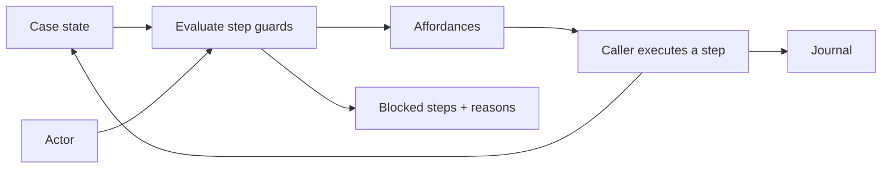

# Affordance

Updated: 2026-09-06

**Compute what a case can do now, for a particular actor.**

Affordance is a TypeScript library for adaptive case management: purchases,
claims, onboarding, and other matters with several independent concerns and
changing requirements. It runs inside your application and stores case state
and execution records in your Postgres database.

## The problem

An FSM or workflow works well when the order of work is stable. A purchase with
multiple buyers, verification, signatures, and funding often needs more
flexibility. Encoding their combinations as process positions makes exceptions
harder to add and leaves you deciding where in-flight cases belong after a
process change.

Affordance uses a smaller model: **a case is a persisted object with state and
independently guarded steps.** Each step describes when it is possible, who may
execute it, and how it changes state. Steps become available through those
facts, without a predefined ordering.



## What the engine does

Given an engine configured with your case types and database:

```ts
const { affordances, blocked } = await engine.affordances(caseId, actor)
// affordances: [{ step: 'commit-funds', scopeKey: 'buyer-7' }]
// blocked: steps this actor cannot take, with named unmet conditions

await engine.execute(caseId, 'commit-funds', {
  actor,
  scopeKey: 'buyer-7',
  input: { amount: 250_000 },
})

const entries = await engine.journal(caseId, { scopeKey: 'buyer-7' })
```

- **Scope and permissions:** one step can produce separate affordances for each
  buyer, document, or payment. `requires` checks the case; `permits` checks the actor.
- **Async execution:** claim the case, run the handler outside a database
  transaction, then commit state and journal together. Executions serialize per
  case; external effects must tolerate retries.
- **Recorded decisions:** the journal preserves the actor, input, claim-time
  guard results and state, committed changes, and failures. Reads and refused
  claims are not journal entries.
- **Changing definitions:** deployed steps apply to existing cases when their
  state remains compatible. State restructuring has a journaled migration API.
- **Optional HTTP:** the adapter adds execute links, input descriptions, and
  explanations so a UI, script, or agent can discover available work.

Start with the [introduction](docs/tutorial/README.md) for a complete case type,
code examples, and the execution model.

## Install

The public packages ship ESM JavaScript and TypeScript declarations for Node
22.12+. The engine uses your Postgres connection and accepts Standard Schema
validators such as Zod.

```bash
npm install @affordance/core pg zod
# Optional HTTP API and Hono binding:
npm install @affordance/http
# For clients that only need the wire types:
npm install @affordance/contract
```

See the [core package example](packages/core/README.md) for database and engine
setup. The reference app and testkit remain private workspace packages.

## Run the reference app

You need Node 22.12+, pnpm, and Docker for local Postgres. From the repository root:

```bash
pnpm install
pnpm db:up
pnpm --filter @affordance/reference-app ui:build
pnpm --filter @affordance/reference-app serve
```

Open `http://localhost:8787/`. Create a purchase in the console, take steps as
different actors, and deliver mock provider events. The server starts with no
seeded cases. See the [reference app guide](packages/reference-app/README.md)
for the exception paths and development options.

```bash
pnpm lint
pnpm typecheck
pnpm test
```

The test suite includes Postgres tests. Biome checks formatting and linting;
`pnpm install` builds the public packages and configures the repository's
pre-commit hook to check staged files. Run `pnpm build` after changing a library
while using the reference app. Root test and typecheck commands rebuild first.

Run `pnpm release:check` to also pack all three libraries and install them in an
isolated TypeScript consumer that exercises Postgres and HTTP. See the
[release guide](docs/releasing.md) for publishing and trusted publisher setup.

## Packages and docs

| Package | Responsibility |
| --- | --- |
| `@affordance/core` | Case types, guards, execution, persistence, journal, ingestion, and migration. |
| `@affordance/contract` | Dependency-free types for `affordance/v1` clients and adapters. |
| `@affordance/http` | Optional HTTP adapter and Hono binding. |
| `@affordance/reference-app` | Group purchase with mock providers and a React console. |
| `@affordance/testkit` | Shared Postgres test setup. |

| Read… | For… |
| --- | --- |
| [Introduction](docs/tutorial/README.md) | The problem, mental model, and a small working example. |
| [Vocabulary](CONTEXT.md) | The project's common language. |
| [Architecture](docs/architecture.md) | Boundaries, guarantees, and tradeoffs. |
| [HTTP contract](docs/affordance-contract.md) | Routes, payloads, visibility, and errors. |
| [Migration](docs/migration.md) | Evolving stored state safely. |
| [Releasing](docs/releasing.md) | Package checks, npm setup, and versioned releases. |
| [Codebase map](docs/tutorial/reference/codebase-map.md) | Where to find each implementation. |

Affordance supplies no scheduler, automatic step runner, durable handler
suspension, hosted control plane, or production UI. The application owns those
integrations and policies; the reference console is a development tool.

---

© 2026 [Mochicode LLC](https://mochicode.com). Licensed under [MIT](LICENSE).
