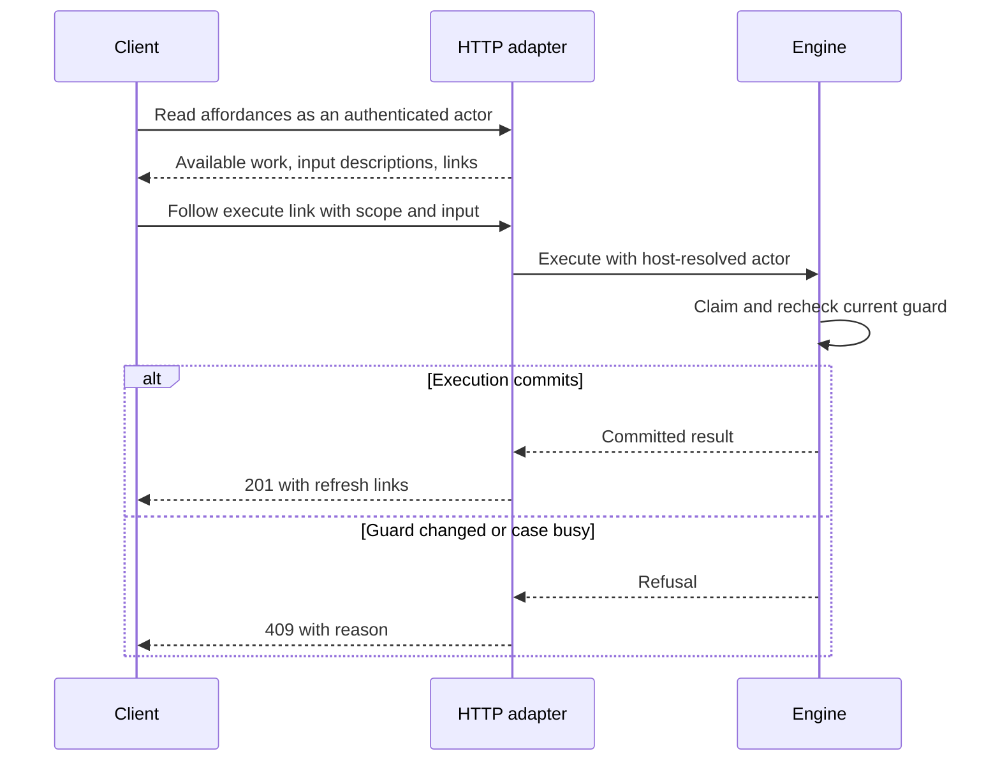

# HTTP contract: `affordance/v1`

Updated: 2026-09-06

A client needs to discover what it can do on a case without encoding the
process itself. The reference app’s HTTP interface returns affordances with input
descriptions and links to execute or explain them. Every contract payload
includes `"contract": "affordance/v1"`.

The authoritative types are in
[the reference app payload module](../packages/reference-app/src/http/payload.ts). The
[router](../packages/reference-app/src/http/api.ts) validates requests; the
[serializers](../packages/reference-app/src/http/contract.ts) construct responses. The host
owns authentication and access to cases, journals, and event endpoints.

## Routes

Paths are relative to the configured mount point, such as `/api`. Returned
`href` values include that prefix. Follow them instead of reconstructing paths.

| Method | Path | Response |
| --- | --- | --- |
| `POST` | `/cases` | `201`, initial affordance payload for the created case. |
| `GET` | `/cases/{id}/affordances` | `200`, available and visible blocked steps. |
| `GET` | `/cases/{id}/affordances/{step}` | `200`, condition results for one step. |
| `POST` | `/cases/{id}/steps/{step}` | `201`, committed execution, or an error. |
| `GET` | `/cases/{id}/journal` | `200`, journal entries oldest first. |
| `POST` | `/events` | `200`, recorded delivery outcome. |
| `GET` | `/dead-letters` | `200`, dead letters newest first. |

| Read endpoint | Optional query parameters |
| --- | --- |
| Affordances | `asOf` |
| Explanation | `scopeKey`, `asOf` |
| Journal | `scopeKey`, `step`, `executionId`, `entry`, `since`, `limit` |
| Dead letters | `system`, `caseId`, `limit` |

`entry` accepts comma-separated journal entry kinds. `since` is an exclusive
journal ordinal cursor; `since` and `limit` must be non-negative integers.

## Create and discover

Using the case type from the [introduction](tutorial/README.md):

```http
POST /api/cases
Content-Type: application/json

{
  "caseType": "tutorial-purchase",
  "state": {
    "buyers": [{ "id": "alice", "committedAmount": null }],
    "titleReportId": null,
    "closedAt": null
  }
}
```

The host supplies the actor separately. If that actor is Alice, the initial
payload has this shape (IDs are illustrative):

```json
{
  "contract": "affordance/v1",
  "case": {
    "id": "case:example",
    "type": "tutorial-purchase",
    "asOf": "2026-09-06T19:00:00.000Z",
    "endedAt": null
  },
  "affordances": [
    {
      "step": "commit-funds",
      "scopeKey": "alice",
      "title": null,
      "description": null,
      "input": { "required": true, "schema": null, "vendor": "zod" },
      "links": {
        "execute": {
          "method": "POST",
          "href": "/api/cases/case:example/steps/commit-funds"
        },
        "explain": {
          "method": "GET",
          "href": "/api/cases/case:example/affordances/commit-funds?scopeKey=alice"
        }
      }
    }
  ],
  "blocked": [],
  "links": {
    "self": { "method": "GET", "href": "/api/cases/case:example/affordances" },
    "journal": { "method": "GET", "href": "/api/cases/case:example/journal" }
  }
}
```

`scopeKey` is absent on unscoped affordances. `title` and `description` come from
the step definition and are `null` when undeclared; a client can display
`title ?? step`.

`input.required` means the step declares an input schema. The host's
`describeInput` hook supplies its wire representation, usually JSON Schema.
Without that hook, `schema` is `null` even though the engine still validates the
input. The example above uses that default. With no input schema, the descriptor
is `{ required: false, schema: null, vendor: null }`.

## Execute and refresh

Follow the affordance's execute link. Include its scope key in the body for a
scoped step; omit it for an unscoped step:

```http
POST /api/cases/case:example/steps/commit-funds
Content-Type: application/json

{ "scopeKey": "alice", "input": { "amount": 100000 } }
```

A successful response describes the committed execution and links to fresh
availability and that execution's journal entries:

```json
{
  "contract": "affordance/v1",
  "execution": {
    "executionId": "execution:example",
    "caseId": "case:example",
    "caseType": "tutorial-purchase",
    "step": "commit-funds",
    "scopeKey": "alice",
    "attempts": 1,
    "seq": 1,
    "delta": [{ "op": "replace", "path": "/buyers/0/committedAmount", "value": 100000 }],
    "dormancy": null,
    "endedAt": null,
    "claimedAt": "2026-09-06T19:00:01.001Z",
    "committedAt": "2026-09-06T19:00:01.412Z"
  },
  "links": {
    "affordances": { "method": "GET", "href": "/api/cases/case:example/affordances" },
    "journal": { "method": "GET", "href": "/api/cases/case:example/journal?executionId=execution:example" }
  }
}
```

Unscoped execution descriptors use `scopeKey: null`. Execution responses include
the delta, not a full state snapshot or guard evaluation.



A listing reserves nothing. Refresh after execution or a refusal; another actor
may have changed the case. A second execute request gets a new execution ID, so
blindly retrying after a lost response is not request-level deduplication.

## Blocked steps, explanations, and visibility

`possible` reports whether `requires` passed; `permitted` reports whether
`permits` passed. Both can be false. Blocked entries carry `unmet` condition
results; explanations carry all visible conditions, with every arm of an
`anyOf` group. Conditions include `name`, `section`, `kind`, `passed`, and an
optional `reason`.

A scope selector failure is represented by the reserved `$scope` condition,
exported as `SCOPE_FAILURE_CONDITION`. Its blocked entry has no scope key, and
its explanation returns the same failure. Invalid or duplicate scope identities
produce an error instead.

| Surface | `permitted` (default) | `all` |
| --- | --- | --- |
| Blocked list | Only entries permitted for this actor. | Every blocked entry. |
| Condition results | `requires` results only. | `requires` and `permits` results. |
| Journal state snapshots | Omitted. | Included. |
| Verdicts, deltas, actor, and input | Retained where present. | Retained where present. |

Visibility filters fields; it is not case authorization or complete redaction
of domain data. Journal inputs, deltas, and event details can contain sensitive
facts. The host controls access to these resources and chooses visibility;
`all` is intended for authorized operators.

`case.endedAt` indicates dormancy. An empty affordance list means the actor has
no work available now, not that the matter has completed. Outcomes belong to
case state and can be exposed through an application-owned read model.

### Evaluation time

`asOf` is accepted on affordance and explanation reads and included in their
evaluation records. Reads always use current state. Current conditions receive
state and actor, with optional scope; they cannot read `asOf`, so changing it
does not preview a timer or make a step available. The engine has no `after`
combinator or scheduler.

The HTTP execute route does not forward a caller's `asOf`; the engine supplies
its current evaluation time. For past decisions, read claimed journal evidence.

## Errors

Framework errors carry a code declared by `REFUSAL_CODES` in the contract
package. The adapter maps it to an HTTP status:

| Status | `error` | Meaning |
| --- | --- | --- |
| `400` | `bad-request` | Unknown step, invalid scope address, or malformed request parameters. |
| `404` | `not-found` | A requested case, case type, or route cannot be resolved. |
| `409` | `step-not-available` | Current guard failed; includes `possible`, `permitted`, and `unmet`. |
| `409` | `case-busy` | Another execution holds the claim, or this execution lost ownership. |
| `422` | `invalid-input` | Step input failed its schema; includes `issues`. |
| `500` | `execution-failed` | Handler or commit failed, including exhausted retries or invalid returned state. |
| `500` | `invalid-state` | Case state failed validation, including initial or stored state. |

For example, an officer trying to close before Alice commits receives:

```json
{
  "contract": "affordance/v1",
  "error": "step-not-available",
  "message": "step 'close-purchase' on case case:example is not available: allCommitted",
  "possible": false,
  "permitted": true,
  "unmet": [
    {
      "name": "allCommitted",
      "section": "requires",
      "kind": "condition",
      "passed": false,
      "reason": "Every buyer must commit funds before closing"
    }
  ]
}
```

This example assumes the title report is already recorded. Error responses do
not currently include refresh links; retain the listing's self link. Permission
condition details follow the same visibility rule as explanations.

Errors outside the framework taxonomy propagate to the host's error handling.
The host can also add its own authorization responses, such as the reference
app's `403` for unauthorized case creation.

## Journal

The response is `{ contract, entries }`, ordered by journal ordinal. Entry kinds
are `claimed`, `attempt-failed`, `completed`, `failed`, and `expired`.

A claim records the state and conditions used to permit execution. Completion
records the state delta; failures record the attempt and error. Expiration is
recorded when another execution takes over an abandoned claim. Reads, creation,
and refused claims do not produce execution journal entries. Visibility controls
which of that evidence the response includes.

## Events and dead letters

`POST /events` accepts a normalized external event:

```json
{
  "system": "esign",
  "externalId": "env-123",
  "type": "envelope.completed",
  "eventId": "delivery-123",
  "payload": { "signedAt": "2026-09-06T19:00:00.000Z" }
}
```

The correlation maps `(system, externalId)` to a case, scope, and optional step.
An optional event `step` overrides the correlated step. `payload` becomes that
step's validated input. The engine's ingestion actor mapping determines who
executes it; the host authenticates the event source.

Deduplication uses an explicit `idempotencyKey` when supplied. Otherwise the key
combines system, external ID, event type, and the event ID or a payload hash.
`occurredAt` can record the provider's timestamp; it does not set claim time.

The response is `{ contract, ingestion }`, with status `executed`, `duplicate`,
or `dead-lettered`. Executed results contain the same execution descriptor as
the execute route. Dead-letter reasons are `unrouted`, `no-step`, or a framework
error code; unexpected execution failures become `execution-failed`.

A valid recorded delivery returns `200` regardless of outcome. Malformed events
can return `400`; failures outside execution, such as persistence failures,
propagate to the host. Redelivery after `case-busy` or `execution-failed` reopens
the event for another attempt. Successful events and other dead-letter reasons
remain deduplicated. There is no scheduled redelivery inside the engine.

`GET /dead-letters` returns `{ contract, deadLetters }`, including original
events and failure details. It is an operator surface, subject to host access
control. Event bookkeeping and execution commit separately; consult the
[architecture](architecture.md) for that boundary.
