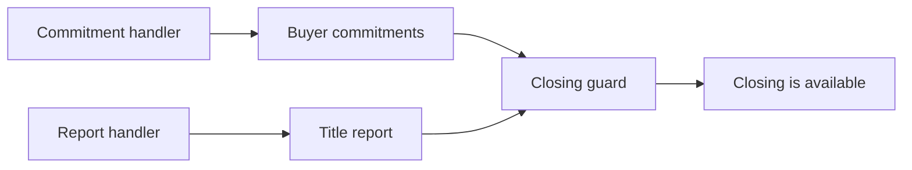
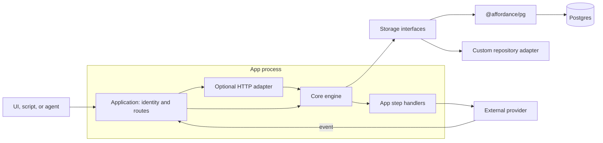
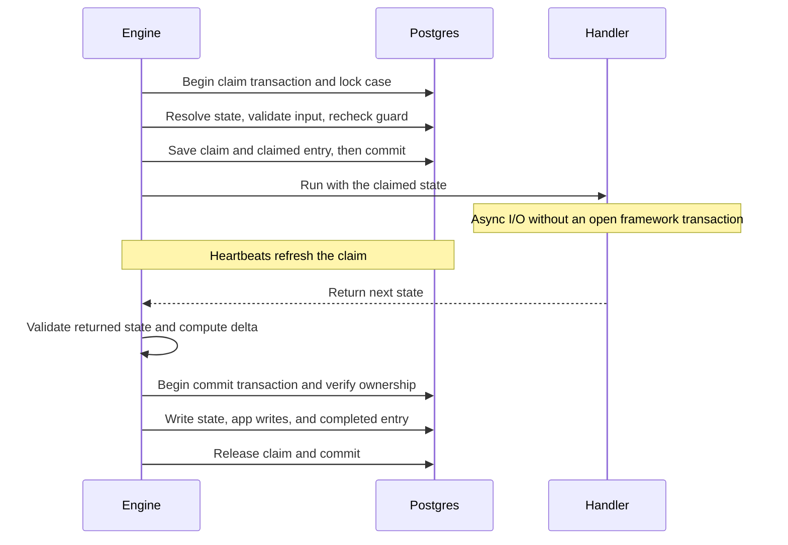
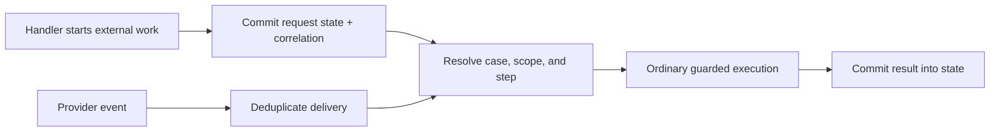

# Architecture

Updated: 2026-09-06

Start with the [introduction](tutorial/README.md) for a case definition you can
follow in code. This document explains the boundaries and guarantees behind it.

## Model facts before process positions

A business matter can contain several concerns progressing independently. A
predefined workflow makes their ordering part of the model, including the
policy for moving in-flight cases when that ordering changes.

Affordance stores a case's current facts and computes available work from
independent guards. A case type defines a state schema and steps. The state can
contain domain statuses such as a verification result; the framework does not
store a current step or process position.

The dependencies are state paths. No step declares a successor. A caller still
chooses whether to execute an available step, so several affordances can exist
at once. Scope binds a step to an element in state; its identity within a case
is `(step, scopeKey)`.

## Application and library boundaries

Affordance is embedded in the app process. The app supplies a storage adapter
and owns identity, access control, application read models, and providers.
`@affordance/pg` supplies the Postgres implementation. Core has no database
driver dependency and exposes validated case reads and paginated listings.

| Boundary | Responsibility |
| --- | --- |
| `model/` | Validate case and step definitions, bind scopes, validate step input. |
| `guards/` | Evaluate named conditions without I/O and retain each result. |
| `engine/` | Bind the registry and store to the public API; compute affordances and explanations. |
| `execution/` | Claim, retries, commit, journal, and guard comparison against past evidence. |
| Core `store/` / `storage.ts` | Case records, validation, and public storage interfaces. |
| `@affordance/pg` | SQL, schema, connection management, and atomic persistence. |
| `ingestion/` / `migration/` | Turn external events or state transforms into executions. |
| HTTP adapter / contract | Translate core records into wire types and apply visibility filtering. |

The execution lifecycle uses the public `LifecyclePort` from
`@affordance/core/storage`. Adapters serialize each case operation and atomically
commit or roll back its changes. Core owns guard evaluation, schema validation,
retry decisions, and the handler lifecycle. Shared contract tests exercise both
memory and Postgres implementations. See [storage adapters](storage.md).
See the [codebase map](tutorial/reference/codebase-map.md) for source links.

## Guards describe availability; claims enforce it

A guard has two maps of named conditions:

- `requires`: is the work possible on this case?
- `permits`: may this actor do it?

Every entry in each map must pass. An unscoped step may use a single level of
`anyOf` to express alternatives; scoped steps currently accept plain conditions
only. Conditions return a boolean or `{ ok, reason }`, and must be synchronous,
side-effect-free, and able to handle historical state. Their context supplies
the actor and bound scope element, without a clock; conditions must avoid I/O.

The engine evaluates every condition, including failed alternatives, so
`affordances`, `blocked`, and `explain` share the same evidence. A condition
that throws becomes a failed result. A scope selector that throws becomes a
blocked `$scope` result in listings; malformed or duplicate scope keys throw
because they make affordance identity ambiguous.

An affordance listing is a read of current state. It reserves nothing. During
execution, the claim transaction checks the current state, scope, input, and
guard again. A changed guard can refuse a previously displayed affordance;
another live execution produces `case-busy`.

## Execution spans two short transactions

The execution is a “pseudo-transaction”: one recorded unit of work containing
an async handler, with atomic claim and commit operations. The Postgres adapter
implements these as two short database transactions:

The claim is exclusive per case, including across scope keys. It keeps other
executions from changing the document while the handler runs, without holding
a row lock or transaction across the handler's external calls. Separate cases
can execute independently.

`ctx.onCommit` registers writes through the adapter-defined commit context.
The adapter commits these with the state update and completed journal entry.
For Postgres the context is a transaction handle or repositories bound to it. `ctx.correlate` registers an external
identifier through that same mechanism. A failed commit rolls these writes
back together; it cannot roll back an external service call.

| Setting | Default |
| --- | --- |
| Claim lifetime without a heartbeat | 30 seconds |
| Heartbeat interval | 5 seconds |
| Handler attempts | 3 total, with exponential delay starting at 100 ms |

Retries reuse the execution ID, starting state, and claim. Registrations from a
failed attempt are discarded. Handlers must leave their input state unchanged
and return a new document, and external effects should deduplicate on
`ctx.executionId`. Separate execute calls have separate IDs; deduplication
across them needs an application-level key.

Invalid returned state and lost claim ownership fail without retry. Other
handler or commit failures retry according to the step's policy. When retries
are exhausted, the execution records failure and releases its claim.

A process crash stops heartbeats. A later claimant can take over an expired
claim and record its abandonment. The old handler cannot commit once another
execution owns the case. Expiry alone permits takeover; the commit check tests
ownership, so an expired claim that has not been replaced can still commit.
There is no background resumer or durable suspension of JavaScript.

## State and evidence are stored separately

The `affordance` schema contains five tables:

| Table | Purpose |
| --- | --- |
| `cases` | Current state, case type name, sequence counter, and dormancy marker. |
| `claims` | Transient ownership of an in-flight execution. |
| `journal` | Append-only execution evidence and outcomes. |
| `correlations` | External identifiers mapped to a case, scope, and optional step. |
| `ingested_events` | Event deduplication and delivery outcomes, including dead letters. |

A `claimed` entry stores the actor, validated input, guard results, evaluation
time, and the state those guards read. A `completed` entry stores the committed
JSON Patch delta. Failed attempts and final failures store errors; `expired`
records abandonment on takeover. Reads, case creation, and refused claims do
not append execution entries.

Reading current state does not replay the journal. To explain a past execution,
read its recorded evidence. `replayGuard` optionally runs today's definition on
that evidence and reports differences; it neither reruns handlers nor changes
the original record.

## Long-running work becomes state plus later events

A handler starts an external interaction and commits the returned identifier.
When the result arrives, ingestion routes it to another step:

The event's payload becomes step input. The host maps the external system to an
actor accepted by its `permits` conditions. Ingestion records unrouteable,
refused, and failed events as dead letters with a reason.

After success, redelivery with the same deduplication key returns `duplicate`.
Dead letters caused by `case-busy` or `execution-failed` can reopen on redelivery;
other recorded reasons remain deduplicated. Ingestion does not schedule those
redeliveries. Its event bookkeeping and case execution are separate writes, not
one transaction covering the provider, event record, and case.

The same approach handles time: an external scheduler executes a step that
records a fact such as `overdue`. There is no built-in scheduler or `after`
condition combinator. `asOf` labels an evaluation instant; current predicates
cannot read it, so changing it alone does not unlock work or rewind case state.

## Changing definitions and stored state

Cases store a type name, without a definition version. New app processes use
the definitions registered in their engines. During a rolling deployment,
processes may therefore use different definitions; the app must keep schemas
and writers compatible during that window. An execution retains the definition
it resolved when it claimed the case.

New steps and conditions can govern existing cases without moving a process
position. Schema changes still need care: schema validation happens before
conditions run, and defaults applied on read do not rewrite the stored row.
Use a compatible schema during a restructure, then a journaled migration.
See the [migration guide](migration.md) for the sequence and dry-run limits.

Ingestion and migration share a system runner that returns per-case execution
failures as outcomes. `engine.execute` throws them to an addressed caller.
Infrastructure failures outside that runner can still propagate to the host.

## Completion, dormancy, and visibility

Completion is a domain fact such as `closedAt`. An empty affordance list only
says that the actor asking has nothing available now.

`ctx.end()` marks the case dormant; `ctx.reopen()` clears that marker. Migration
scans exclude dormant cases by default. Dormancy does not block reads or
execution: the reference app can record a deed after closing a purchase.

Core reads return full records to the host. The HTTP adapter defaults to
`permitted` visibility: it omits blocked steps the actor is not permitted to
execute, removes permission-condition results, and omits journal state
snapshots. `all` includes those details. Visibility does not authorize access to
cases or redact all domain data from deltas, inputs, and journal entries; the
host owns that policy. See the [HTTP contract](affordance-contract.md).

## Scope of the library

Affordance provides guarded work, persistence, and evidence. The application
supplies scheduling, automatic callers, provider adapters, authentication, and
its UI. Durable workflow execution can sit behind a step when needed, with its
result recorded through ingestion. The reference console demonstrates the
model; it is not a production control plane.
