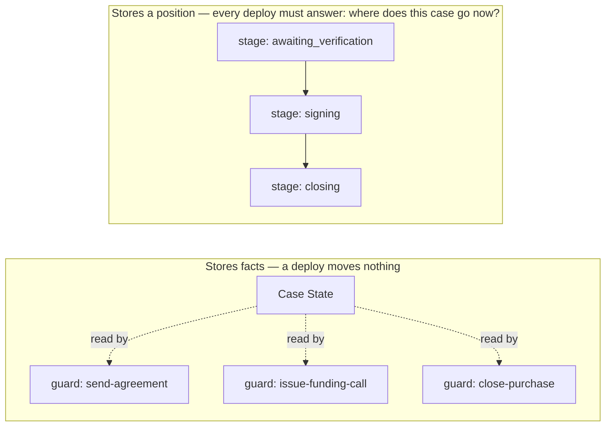
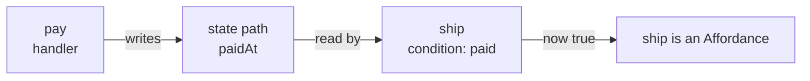
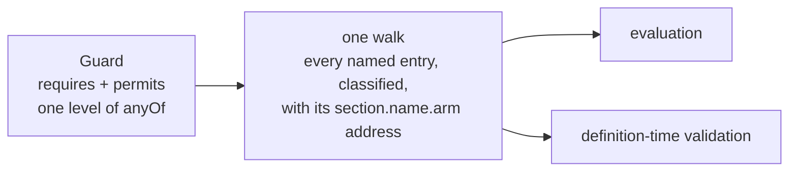
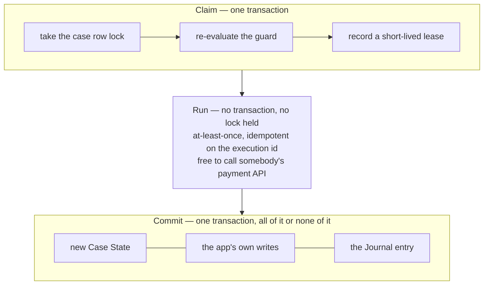
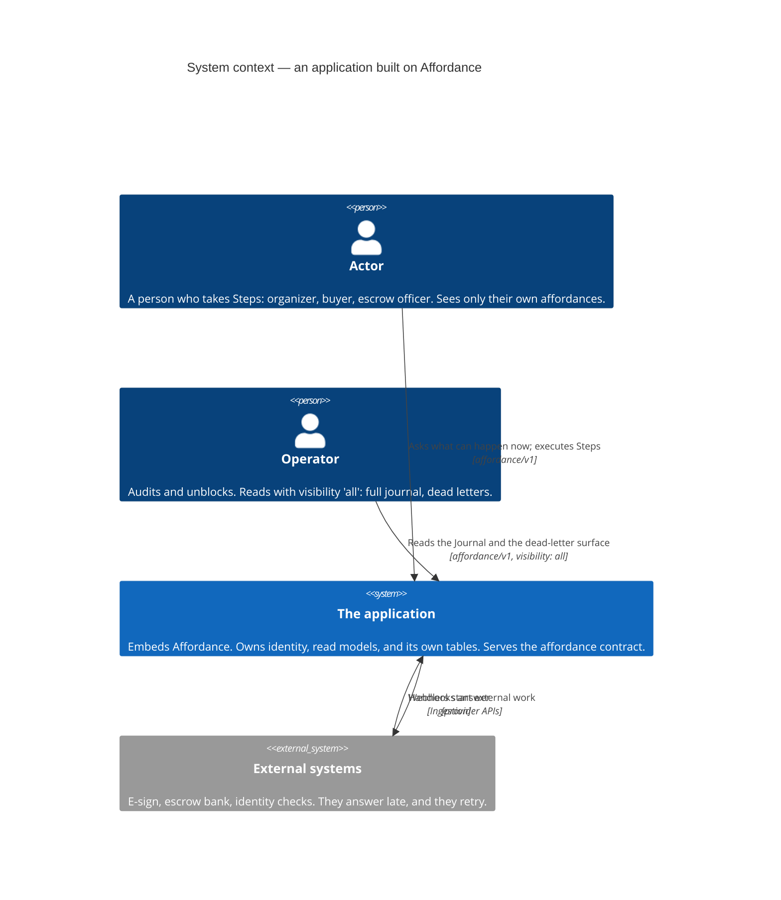
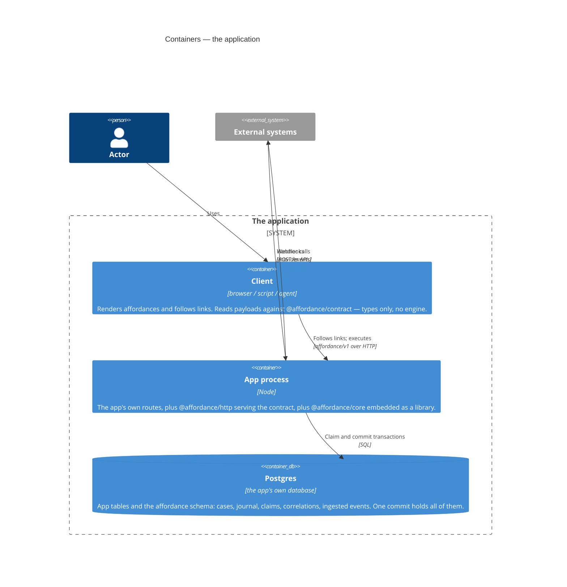
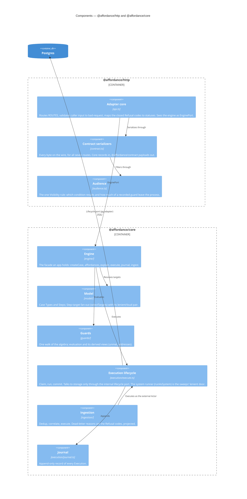

# Architecture

## The bet

Long-lived business processes are killed by versioning. A system that records
*where a case is* must answer, at every deploy, "where is this in-flight case
in the new structure?" For matters that run for months there are two honest
answers: keep every historical version running until its last case drains, or
rewrite every in-flight case's stored position by hand. A `status` column is a program counter; so is a
stage in a declared graph.

So this engine stores no position. A case type declares a **state schema**
and a set of independently guarded **steps** — nothing else, not even a test
for whether the matter is finished. What can happen next is computed on
demand by evaluating each step's guard against current state. Sequencing is a
data dependency between guards, not a declared edge.

The consequence is the whole point: a process change is a deploy. Change the
definitions and every in-flight case is governed by the new ones immediately,
because there was never a position to migrate.

Everything below follows from that, or defends it.

## The model

A **case** is one long-lived matter, and its **case state** is a single
document — the only thing that changes. A **step** is an independently-defined
unit of possible work: a guard plus a handler. A **guard** is the step's full
set of named **conditions**; when all of them hold for a given **actor**, the
step is an **affordance** — something that can be done now, by them.

Sequencing is what falls out of that, and it is worth seeing. No step names
another step. Two steps are ordered because one writes a path that the other's
guard reads:

That shared path is the only connection between them.

A step may declare a **scope** over a collection in state, which fans it out:
one affordance per element, identified by `(step × scope key)`. Buyer #7's
verification escalation is a different affordance from buyer #9's, with its own
guard evaluation and its own audit trail.

## When is a case finished?

The engine does not say, and declines to hold an opinion. A completion
predicate and a `complete` field would both be a position by another name: one
distinguished answer about where a case stands, declared apart from the guards
that decide everything else.

The question splits in two, and each half is already answered.

**"Is there anything to do here?"** is the affordance listing being empty for
the actor asking. Nothing to declare and nothing to store — a case whose work
reappears simply has affordances again, with no flag to clear.

Note *for the actor asking*. "Nothing for anyone" sounds like the stronger
question and is close to useless: a step that materializes an external fact
stays possible forever, because the outside world can always speak. A purchase
whose deed is recorded still admits `record-wire`; money can arrive after
everything is signed and settled, and the system must still record it. Cases
are almost never exhausted. They run out of
work for the people looking at them.

**"Did this matter end well?"** is an outcome, and outcomes are state: a closed
purchase has `closedAt`, an abandoned one has `withdrawnAt`. The engine never
needed to know. Over the wire, where state is deliberately absent, outcomes
surface through which capabilities appear — being offered `record-deed` is being
told the purchase closed, because that is what its guard requires.

What the engine *does* record is **dormancy**. `end()` marks a case as no
longer worth attention, which drops it from the
queries that sweep. That is an operational fact, not a verdict on the matter.
It is stored for a plain reason: two of its consumers are SQL predicates, and
no app predicate can go in a `where` clause. An ordinary step reverses it.

## Guards advise, handlers enforce

Conditions are **named, synchronous, side-effect-free predicates**. Named,
because "why can't I close this purchase?" is the most frequent question in a case
system, and an opaque `(state) => boolean` throws away the answer. Synchronous
and pure, because affordance computation and historical
reconstruction evaluate guards constantly. A guard that could call a service
would fan a case list out to third parties, and one provider outage would leave
the engine unable to say what is possible for any case at all.

Guards are split into `requires` (is this possible on this case, for anyone?)
and `permits` (may *this actor* take it?), so the engine can mechanically
distinguish "not yet" from "not you".

The algebra stays deliberately small: two flat AND-maps, one level of named
`anyOf`, no nested boolean trees. Its shape is known in exactly one place — a
single walk yields every named entry, classified, with its `anyOf` arms and its
`section.name[.arm]` address. Evaluation and definition-time validation
are both filters over that walk. An algebra
with several independent readers acquires, sooner or later, a corner that one of
them handles differently from the rest.

An affordance is therefore a belief derived from the last known snapshot, not
a reservation. State can move — and definitions can be deployed — between
rendering an affordance and taking it. So execution re-evaluates the guard
transactionally and rejects with the current unmet conditions. That single
mechanism covers both races, which is why a deploy needs no special handling.

External facts enter state the same way everything else does: through a step,
**materialized** on event or on demand. There is no other door.

## Execution

An **execution** is one recorded run of a step: **claim → run → commit**.

The claim takes the case's row lock, re-evaluates the guard, and records a
short-lived lease. The handler then runs *outside* any transaction — a row lock held
while waiting on somebody's payment API would stall every other execution on
the case for as long as the provider takes to answer, and workflow frameworks
are notorious for exactly that — and the commit writes the new state, the app's own writes, and
the journal entry together, or none of them.

Handlers are short, at-least-once and idempotent, with the execution id as the
idempotency key. Anything long-running is modeled as state plus more steps,
never as a suspended function: there is no replay, no deterministic execution
sandbox, no mid-handler suspension. A crash surfaces as a retried or failed
execution, and the lease expires so a dead process cannot deadlock a case.

Lease expiry is judged by the storage's own clock — the one clock every
competing process shares — deliberately, not by the engine's injected clock,
which governs the process-side "as of now": guard evaluation instants,
journal timestamps. The heartbeat and the retry delay run on process timers
behind an internal seam — a swap point where tests plug in a fake timer — so
the lifecycle's tests drive elapsed time instead of sleeping through it.

## What is remembered

Current state is a materialized document; history is an append-only
**journal**. Every execution appends what it was: the step, the scope, the
actor, the guard evaluation, **the state that evaluation ran against**, and
the resulting delta as JSON Patch.

That last detail is what makes audit exact rather than approximate. "Why was
this available last Tuesday?" is answered from what the system actually
believed on Tuesday — never re-derived by running today's code over old
events. State is not a fold of the journal, deliberately: folds change with
deploys, silently rewriting history out from under an auditor.

Because entries carry scope keys, a per-track audit — everything that ever
happened to buyer #7 — is a filter, not a reconstruction.

## Time

A condition may not read the clock — a guard's answer is a function of
(state, actor) alone, evaluated as of an explicit instant. That keeps
"evaluate this guard as of T" well defined, which is what makes historical
reconstruction exact.

Time-*driven* behavior (a condition that should flip because a duration
elapsed, with nobody touching the case) is not an engine feature, and that
is a stance, not a gap: to the engine, time is one more external system. A
fact about time worth acting on — a deadline passed, a review stalled —
enters through the same door as any other outside fact: an external trigger
(a scheduler, a cron job, a queue's delayed delivery) executes an ordinary
step, as an ordinary actor, and the commit records exactly when the system
learned the fact and acted on it. Because time only ever enters as data,
replaying "as of T" stays exact; a clock read inside a guard, or a
scheduler inside the engine, would trade that away for a convenience the
ingestion door already provides.

## Things that happen without a person

One, and it goes through the ordinary lifecycle rather than a side channel:

**Ingestion.** An external identifier is registered against a case (and scope
element) by the handler that starts the interaction, in the same commit. When
the webhook arrives it is deduplicated by a unique insert, correlated, and
executed as an ordinary step with the external system as the actor. An event
that could not be applied — unroutable, refused by a guard, arriving at a busy
case — is never dropped: it lands in a dead-letter surface with a reason.

## Living with float

Because cases float to the latest definitions, conditions must be **total over
historical state**. A condition will meet documents written before it existed,
and must handle absence deliberately: `s.split?.confirmed ?? false`.
This discipline is what the whole design costs a condition author, and it is
small.

Almost every change is additive and needs nothing else. The exception is a
genuine restructure — a rename, a split, a scalar becoming a collection — that
no expression can read. Those run as journaled system executions through the
normal commit path, marked in the journal so re-running is a no-op. Migration
is the exception, never the posture.

Totality is a discipline for condition authors; the engine owes a matching
one. Wherever an old document can defeat the engine itself — a scope selector
that throws, a stored state its schema no longer accepts — there are two
resolutions. Which one a caller gets is part of the interface, not a detail of
some implementation:

- **Lenient**, for a sweep. A migration scan
  ranges over a whole case type, and one
  unreadable case must not take the sweep down. It contributes nothing and the
  sweep continues.
- **Loud**, for an addressed request. A claim, an `affordances` read, an
  `explain`: somebody named a case and a step and is owed an answer about
  *those*. Silence would be a wrong answer, so it throws, naming what it
  could not read.

The same pair, drawn wherever the pressure repeats — around resolving a step
target, around resolving a case, around reading an instant. Fan-out itself
is one function (`selectTargets`), and every reader — the listing,
loud addressing — is a
filter over it, so the two resolutions cannot quietly grow a third.
Addressing likewise: one implementation (`addressTarget`) answers "step X,
element K, on this state" with the target or the precise failure as a value;
`resolveTarget` is its loud filter (it throws the failure), and audit replay
is its lenient one (a Journal entry today's definitions cannot address is
reported as drift, because one drifted entry must not take down the audit
of the rest).

Running a step repeats the pressure, and gets the same treatment.
`Engine.execute` is the loud half: an addressed request, owed its refusal.
Every sweep that runs steps as the system — ingestion,
migration — goes through one runner (`runAsSystem`) that never throws and
answers with a total outcome: committed, or settled with whatever the run
threw. A Refusal keeps its identity inside the settled value, and whether
what settled *was* a Refusal is asked in exactly one place — ingestion's
dead-letter projection, where a refusal's code becomes the reason and a bug
becomes `execution-failed` (a bug is not a refusal). Migration consumes the
settled value as a report and moves on. Each sweep is a filter over the
same outcome, so a third sweep cannot invent a third absorption policy.

One failure refuses to be lenient anywhere: duplicate or malformed scope
keys. Those corrupt affordance identity itself — the `(step × scope key)`
that journal entries and refusals both name — so they throw through
*both* paths. A sweep may skip a broken selector; it never files work under
an identity that two elements share.

## Legibility

The known cost of emergent behavior is that it is hard to see, and the
mitigations are core, not extras:

- **`explain`** returns every condition of a step, passed and failed, with
  reasons in the domain's own words.
- **The affordance contract** is specified as a wire format, so a client — a
  UI, a script, or an agent treating it as a tool list — never needs
  out-of-band knowledge of the process. That includes the human words: every
  entry carries its step's declared `title` and `description`, so a tool
  list arrives with its tools described and a console needs no label table.
- **A refusal names its own kind.** Every deliberate no — a guard that said
  no, a busy case, an unresolvable address — carries a code from a closed set,
  declared where the refusal is raised rather than in a mapping table at each
  edge. An adapter translates that closed set, so a refusal it has never heard
  of is impossible rather than a 500. Anything that is *not* a refusal is a
  bug or an infrastructure failure, and passes through untranslated: the one
  thing an edge must never do is answer as though a crash were a verdict.

## Shape

A TypeScript library embedded in the application, persisting to the app's own
Postgres. No server, no control plane, no hosted anything: guard evaluation,
state writes and journal appends need no central
infrastructure, and the operational footprint of the server-based
alternatives — a service to provision, upgrade, and keep alive — is the cost
their users resent most. Postgres is a hard dependency, with no
storage-adapter abstraction — the *public* seam is documented, not built.
(Inside the library, the Execution lifecycle runs against a narrow internal
port, so its tests do not need a database. That port is not exported, and it
does not soften the Postgres dependency.)

## The shape, drawn (C4)

Three views, one per C4 level — C4 being the convention of drawing a system
at successive zoom levels: context, then containers, then components.
Affordance is a library, so the *system* is
the application that embeds it — there is no Affordance box to draw at the
context level, and that is the point.

**System context.** Who touches the application, and how.

**Containers.** One process, one database, one browser.

**Components.** Inside the process: the adapter translates, the engine
decides, the lifecycle writes.

## Deliberately absent

Replay-based durable execution, permanently — the incumbents have years of
engineering invested there that a newcomer cannot catch up to, and adopting
it would import the two costs this design exists to escape: handlers
restricted to deterministic code, and in-flight cases pinned to the
definitions that started them. Heavy machine automation belongs behind a step,
delegated to a tool built for it, with the outcome materialized back into
state.

Rule automation — steps the framework runs of its own accord when a guard
flips — was built and then removed. Every execution already has someone
behind it: a person takes an affordance, an external system's event ingests,
and time itself is an external system (see Time). A framework-run step added
a second kind of actor, broke the chain of "who caused this" that the journal
otherwise keeps intact, and needed a vocabulary of suppression flags to
police it, all to save a caller an explicit execute. Whatever would have
been marked `auto` is either pure derivation (fold it into the step that
materializes the fact) or a real decision (leave it as an affordance for
whoever owns it).

Also: no scheduler, no server or hosted control plane, no service-specific
connectors ever, no UI, no multi-language SDKs. These are choices, not gaps.
