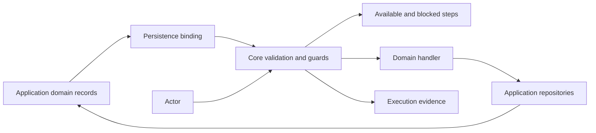
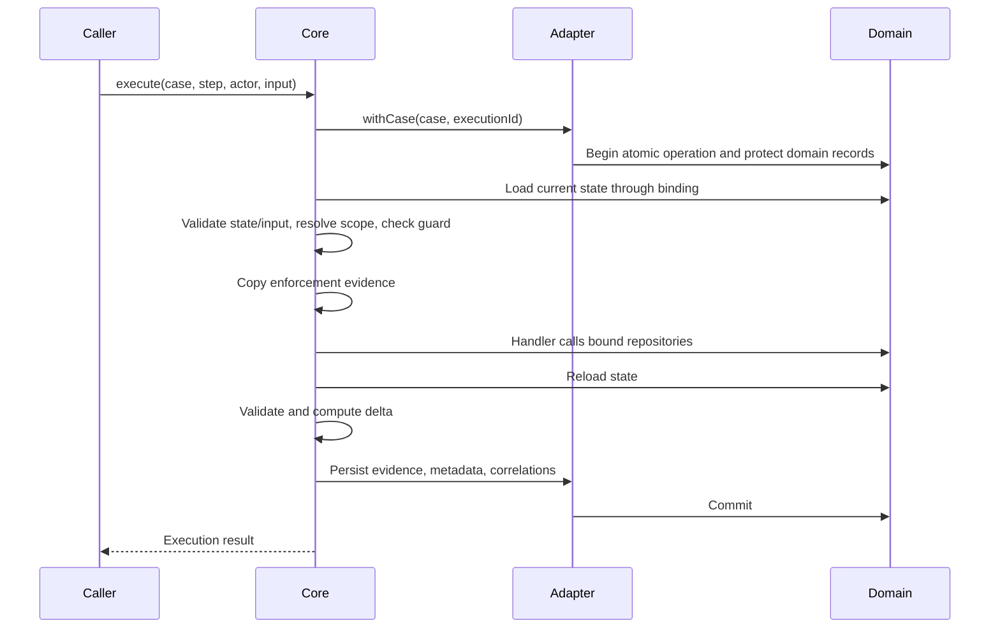

# Architecture

Affordance computes available work from current domain facts and actor
permissions. A case type consists of a state schema and independently guarded
steps. No step declares its predecessor or successor: changes in domain facts
change which guards pass.

## Application facts, framework evidence

The application owns its domain tables. An adapter loads those records into a
Case State document, which core validates before evaluating guards. The framework
persists case identity, type, domain reference, dormancy, execution sequence,
correlations, delivery records, and journal evidence. It does not persist a second
authoritative current-state document.

Core knows no database or ORM. `EngineStorage` and `AtomicCasePort` state the
behavior adapters must implement. `@affordance/pg` implements it using Postgres
connections and transactions; the application binds repositories to those
transactions. Shared tests exercise the same engine behavior through independent
memory and Postgres implementations.

## Guards and scopes

A guard contains `requires` conditions over case facts and `permits` conditions
for the actor. Conditions are named, pure synchronous functions. They return a
boolean or `{ ok, reason }`. Unscoped guards can express a named `anyOf` group.
Scoped steps select a collection and bind one element by a stable key; guards
and the handler receive that binding.

An affordance listing is a preview, not a reservation. Execution reloads state,
resolves scope, validates input, and reevaluates the guard inside the adapter's
protected operation. Unmet conditions refuse execution before any handler runs.
The evaluation instant comes from the engine clock, or an explicit core caller;
the HTTP execute route does not accept a client-selected instant.

## One short atomic operation

Postgres serializes executions with a case-row lock and then invokes the
application's domain protection rule. All domain writers must follow that same
rule, including child-record writers. A framework lock cannot protect unrelated
SQL that ignores the domain protocol. Other adapters may use another strategy,
but must protect the guard's read set and make domain changes and evidence atomic.

Handlers return no replacement document. Core reloads state and validates it
before committing. Invalid resulting state, handler errors, and evidence failures
abort the operation. No automatic retries replay application code. Application
code must await all repository operations and must not perform network work in
an atomic handler.

A connection failure during COMMIT has an uncertain outcome. The adapter reports
that uncertainty with execution identity; it never treats a lost acknowledgment
as proof of failure. Postgres reconciliation waits on the same case-row lock and
then checks whether completion evidence exists.

## Journal and dormancy

Every committed execution writes two entries atomically: `started`, with immutable
enforcement evidence, and `completed`, with its delta and dormancy. The result
contains `startedAt`, `committedAt`, and the reloaded resulting state. A partial
journal page may contain only one entry; folding does not make it an externally
observable durable claim. Reads, attachment, refusals, and rollbacks create no
ordinary execution entries.

Historical snapshots use core's serialization format, preserving runtime types.
Current reads always load the application records. External edits do not advance
the framework sequence or create evidence automatically.

Completion is expressed in domain facts. `end()` marks the case dormant and
`reopen()` clears the marker; dormancy hides the case from default listings but
does not prevent subsequent execution.

## Long-running integration

The adopter owns external dispatch, ordering, idempotency, cancellation, and
recovery. Its orchestration can invoke guarded operations before and after an API
call. Each operation loads current facts. The library does not keep a transaction
or case claim open across the call and supplies no outbox or worker subsystem.

Correlations associate external identifiers with a case, optional scope, and step.
Ingestion deduplicates deliveries, finds a correlation, and executes the same
guarded domain operation. Delivery settlement remains separate from execution;
an uncertain commit propagates rather than being falsely dead-lettered.

## Definition and domain evolution

Case definitions are registered at startup and resolved by name. Existing cases
use the current deployed definition; schema compatibility with domain records is
the application's responsibility. Domain migrations use the application's normal
database tooling. Journal replay retains past evidence even when today's step can
no longer address the old snapshot.

See [storage adapters](storage.md) for the concrete contract and examples, and
[the tutorial](tutorial/README.md) for the reference purchase application.

## Existing operations with independent transactions

`engine.executeNonAtomic` resolves and invokes the registered step using
application-supplied operations. Core loads and validates state, resolves scope,
validates input and evaluates the same guard machinery used by atomic execution.
It does not lock cooperating writers. The operation owns admission, transactions,
external calls and its existing retry behavior. Core invokes the handler once
and propagates its error unchanged, including when earlier effects committed.

After handler success, core returns the invocation identity and pre-operation
guard evaluation. It performs no second load or persistence that could turn
success into failure. This result makes no state-delta, sequence or atomic-commit
claim. Correlation and dormancy helpers are unsupported; adopters manage that
metadata separately. Atomic execution and system ingestion remain unchanged.

Applications may persist a completion receipt separately after success. A crash
or write failure can leave a successful operation without that receipt. Recording
failure must not change the known business outcome or cause a retry. Absence of a
receipt is not evidence of failure, and separately observed state is not an
atomic delta.
