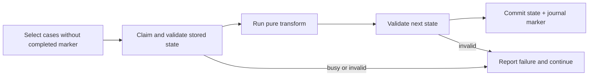

# Migrating case state

Updated: 2026-09-06

Changing available work usually means deploying new step definitions. Changing
the stored document may also need a migration. These are separate concerns:
cases have no process position to move, but their state must still satisfy the
schema registered by the running engine.

## Choose the smallest change

| Change | Approach |
| --- | --- |
| New step or condition | Deploy it; existing compatible cases are evaluated against it. |
| Optional field | Accept absence in the schema and handle it in conditions and selectors. |
| Required field with a valid default | Add a schema default; it applies on read and is persisted on a later write. |
| Rename, split, or changed representation | Read both shapes during rollout; migrate when you need stored rows normalized. |
| Changed scope keys | Plan how old journal entries and correlations retain their meaning. A state migration alone does not rewrite them. |

A fallback in a condition cannot rescue a document rejected by its schema.
Validate stored examples against the transitional schema before deploying it.

## Example: rename a collection

Suppose the existing `ownership` case type is changing `buyers` to `coOwners`.
Register a schema accepting both during the transition, and keep conditions,
selectors, and handlers compatible with both. This minimal example preserves
other fields through `z.looseObject`:

```ts
import { z } from 'zod'

const Owner = z.object({ id: z.string(), name: z.string() })
const OwnershipState = z.looseObject({
  buyers: z.array(Owner).optional(),
  coOwners: z.array(Owner).optional(),
})
type Ownership = z.infer<typeof OwnershipState>

const ownersOf = (s: Ownership) => s.coOwners ?? s.buyers ?? []

const renameBuyers = (s: Ownership): Ownership => {
  const { buyers, ...rest } = s
  return { ...rest, coOwners: s.coOwners ?? buyers ?? [] }
}
```

Use `ownersOf` wherever steps read the collection. The transform preserves
owner IDs, removes the old key, and remains safe if a case already has the new
shape. In a real case type, retain its existing field schemas and constraints.

With an `engine` serving that transitional `ownership` definition, preview the
migration and inspect the per-case deltas:

```ts
const migrationName = 'rename-buyers-to-co-owners'
const preview = await engine.migrate('ownership', migrationName, renameBuyers, {
  dryRun: true,
  includeEnded: true,
  onProgress: ({ caseId, delta, error }) => console.log(caseId, delta, error),
})
```

A dry run computes deltas without claims, writes, or journal markers. It does
**not** validate the transformed result against the schema, and it cannot prove
that a real execution can acquire the case. Validate transform outputs
separately; an unreadable stored document can reach a dry-run transform even
though a real migration would fail before invoking it. A snapshot that cannot be
decoded at all is reported as a per-case failure in either mode; other candidates
continue. An adapter query failure stops the sweep.

Once the preview and schema checks pass, run one migration runner:

```ts
const report = await engine.migrate('ownership', migrationName, renameBuyers, {
  batchSize: 200,
  includeEnded: true,
  onProgress: ({ processed, caseId, outcome }) =>
    console.log(processed, caseId, outcome),
})
console.log(report.migrated, report.unchanged, report.failed)
```

## What commits



Each case runs an ordinary execution under `migrate:<name>`, with a migration
actor and one attempt. The step has no business guard and is not exposed as an
affordance. Its completed journal entry is the migration marker.

- A completed marker skips that case on later runs of the same name, even if
  the transform would now produce a different result. Use a new name for a new change.
- An unchanged result still commits and receives a marker.
- Busy cases, invalid stored or returned state, and throwing transforms appear
  in `report.failed`. They have no completed marker and can be retried later.
- `caseIds` and `limit` can restrict a run. Dormant cases are excluded unless
  `includeEnded: true`; include them before removing compatibility for old state.
- Transforms must be pure and preserve unrelated fields. External work belongs
  in ordinary steps. Database failures during scanning can still abort the run.

## Roll out the schema change

1. Deploy a schema and steps that accept both representations.
2. Ensure every running writer uses the new representation before removing the
   old one from stored rows; old processes must not restore it after migration.
3. Preview and validate outputs, then migrate. Resolve failures and rerun with
   the same name and intended scope.
4. Confirm coverage, including dormant cases, and inspect representative stored
   documents. A zero-candidate rerun checks markers, not the shape of later writes.
5. Deploy the final schema and remove the old-field fallback.

The journal retains the claimed state and committed delta for each migration.
`asOf` reads do not reconstruct historical state. See
[architecture](architecture.md) for the execution and audit guarantees.
