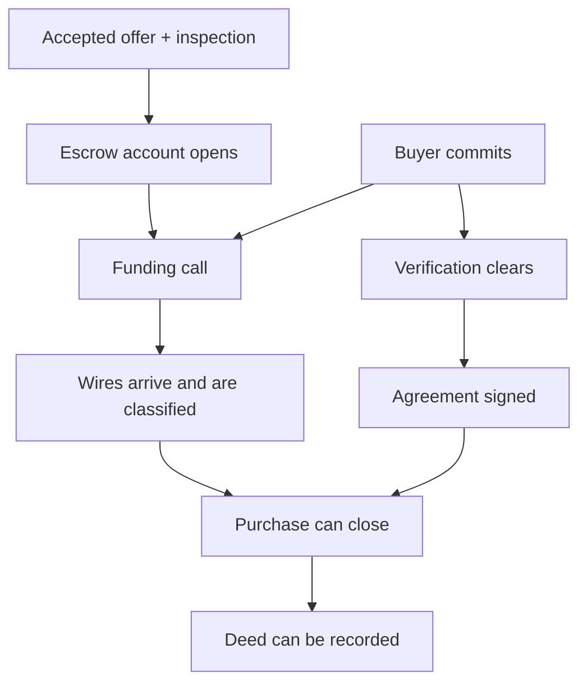

# Reference app: a group house purchase

Updated: 2026-09-06

Several buyers pool money for one purchase while verification, signatures,
escrow, and funding progress independently. This app shows how guarded steps
handle that work and its exceptions. Providers and money movements are mocked;
the engine, Postgres persistence, guards, and HTTP contract are real.

Read the [introduction](../../docs/tutorial/README.md) first for a smaller case.

## Run it

From the repository root, with Node 22.12+, pnpm, and Docker:

```bash
pnpm install
pnpm db:up
pnpm --filter @affordance/reference-app ui:build
pnpm --filter @affordance/reference-app serve
```

Open `http://localhost:8787/`. The server seeds no cases. Create a purchase in
the console using the prefilled house purchase (edit its address and target if
desired), then use the actor lanes to take steps as the organizer, individual
buyers, and escrow officer. Each lane asks about the same state as a different
actor; one fixed observer persona supplies the main read.

Provider requests appear in the console's external-world panel. Deliver their
events to bring results into case state. Delivery is manual in the served demo;
the engine does not run steps when their guards become true.

`PORT` and `DATABASE_URL` override the server's defaults. The API is mounted at
`/api`; `/dev` provides the console's inspection and provider controls.

For UI development, keep the app server running and use:

```bash
pnpm --filter @affordance/reference-app ui:dev
```

Vite serves port 5173 and proxies `/api` and `/dev` to port 8787. `ui/` is a
standalone React + Mantine project. Rebuild it with `ui:build` after changes when
using the app server's static console; `serve` requires an existing `ui/dist`.

## What to observe

These are state dependencies, not a graph configured in the engine:



The organizer closes when the funding call exists, committed buyers have
signed, wires are settled, and funding is sufficient or a short wire has been
accepted. Closing writes `purchase.closedAt` and marks the case dormant.
`record-deed` remains available afterward: dormancy does not freeze the case.

### Wire exceptions

`record-wire` classifies an incoming wire in the same execution that records it.
It compares the source account and amount with the buyer's expected details:

| Outcome | Available resolution | Actor |
| --- | --- | --- |
| `matched` | Already settled | — |
| `short` | `accept-short-wire` | Organizer |
| `over` | `refund-over-wire` | Escrow officer |
| `wrong-account` | `return-wire` | Escrow officer |

Each resolution is scoped to one wire. These handlers record the mock decision;
they do not initiate real transfers. There is no separate automatic
`reconcile-wire` step.

### Verification review

A provider result can set a buyer's verification status to `review` and record
`flaggedAt`. That makes `escalate-verification` available to the escrow officer
for that buyer. It is a judgment call, with no seven-day timer or `after`
condition. After escalation, `clear-enhanced-review` records either `clear` or
`rejected` from the officer's input.

## Providers and the journal

Mock providers return their own IDs and queue later events. The initiating
handler registers each ID with `ctx.correlate`, so a provider result can find the
case and scope without carrying a case ID.

Each queued event is delivered three times by default. Successful redeliveries
return `duplicate`; transient dead letters can reopen as described in the
[HTTP contract](../../docs/affordance-contract.md#events-and-dead-letters).
Tests use `app.settle()` to flush due events. A custom driver can use
`services.start(engine)` to deliver on a timer; the served demo leaves delivery
to the console.

The journal lets you inspect the step, actor, scope, claim-time conditions, and
committed delta for each execution. Compare the buyer and organizer lanes with
the recorded actor when following the commitment and closing steps.

## Read the code

| File | Responsibility |
| --- | --- |
| [state.ts](src/state.ts) | State schema, independent domain statuses, and actor shapes. |
| [steps.ts](src/steps.ts) | Guarded steps, provider calls, and scoped exception handling. |
| [purchase.ts](src/purchase.ts) | Case type and initial state. |
| [services.ts](src/services.ts) | Mock providers and queued event delivery. |
| [app.ts](src/app.ts) | Engine, actor mapping, HTTP adapter, and development routes. |
| [serve.ts](src/serve.ts) | Server startup and static UI requirement. |
| [ui/](ui/src) | Actor lanes, schema-driven input forms, and inspection panels. |

The demo reads `x-actor-id` and `x-actor-roles` directly for impersonation.
Its `/dev` routes expose state and operator controls. These are development
conveniences; a deployed application needs authenticated actors and its own
access policy for those surfaces. The host restricts HTTP case creation to the
organizer role, separately from step guards.

Run repository checks from the root:

```bash
pnpm lint
pnpm typecheck
pnpm test
```

[Happy-path](test/happy-path.pg.test.ts) and
[exception](test/exceptions.pg.test.ts) tests execute steps through links from
HTTP affordance payloads. Other tests cover development routes and shared
console metadata. The full suite requires Postgres.
